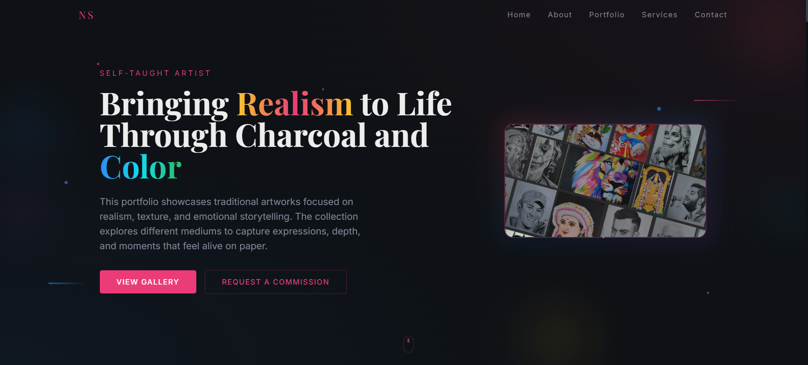

# 🎨 Nikhil Shanbhag – Art Portfolio Website

A modern, vibrant, and interactive art portfolio website showcasing realistic portraits, traditional artworks, and religious art created using charcoal, graphite, colored pencils, and markers.

This portfolio is designed to highlight artworks in a gallery-style layout with filters, an immersive carousel viewer, and artistic UI elements inspired by paint, brushes, and canvas aesthetics.

---
## ✨ Features

🖌️ Art-Themed Design

- Dark canvas-style background with vibrant paint strokes and splashes
- Artistic icons (paintbrush, palette, pencil, canvas)
- Minimal yet expressive UI to keep focus on artworks

🖼️ Portfolio Gallery

- Responsive image gallery grid

Filters by:
- Medium (Charcoal, Graphite, Colored Pencil, Marker)
- Category (Portraits, Religious, Traditional)

- Click any artwork to open a full-screen carousel slider
- Auto-slide with manual navigation and artwork details

🎞️ Artistic Loading Animation

- Custom art-themed preloader
- Paintbrush strokes and colorful paint splashes animation
- Smooth transition revealing the homepage like a painted canvas

🚀 Getting Started
1️⃣ Clone the repository
git clone https://github.com/Nikhil-1503/canvas-of-nikhil.git
cd canvas-of-nikhil

2️⃣ Install dependencies
npm install

3️⃣ Run the development server
npm run dev

Open http://localhost:3000 to view the website.

📸 Screenshots

🌍 Live Demo

🔗 Live Website: https://canvasofnikhil.netlify.app/

📷 Instagram: https://instagram.com/nikhil.1503